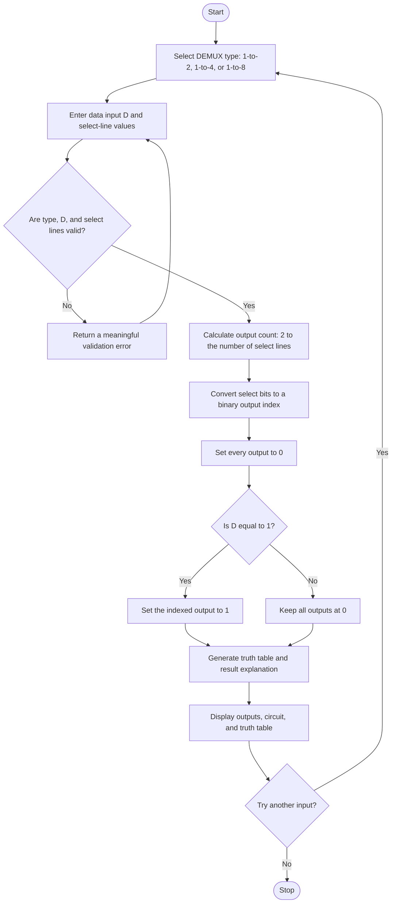

# DEMUX Simulator Flowchart

```mermaid
flowchart TD
    A([Start]) --> B[Select DEMUX type: 1-to-2, 1-to-4, or 1-to-8]
    B --> C[Enter data input D and select-line values]
    C --> D{Are type, D, and select lines valid?}
    D -- No --> E[Return a meaningful validation error]
    E --> C
    D -- Yes --> F[Calculate output count: 2 to the number of select lines]
    F --> G[Convert select bits to a binary output index]
    G --> H[Set every output to 0]
    H --> I{Is D equal to 1?}
    I -- Yes --> J[Set the indexed output to 1]
    I -- No --> K[Keep all outputs at 0]
    J --> L[Generate truth table and result explanation]
    K --> L
    L --> M[Display outputs, circuit, and truth table]
    M --> N{Try another input?}
    N -- Yes --> B
    N -- No --> O([Stop])
```
